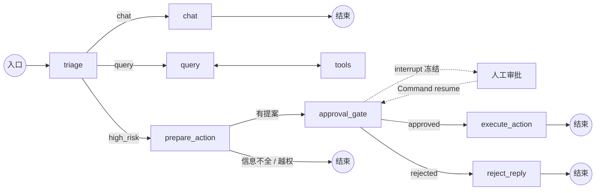
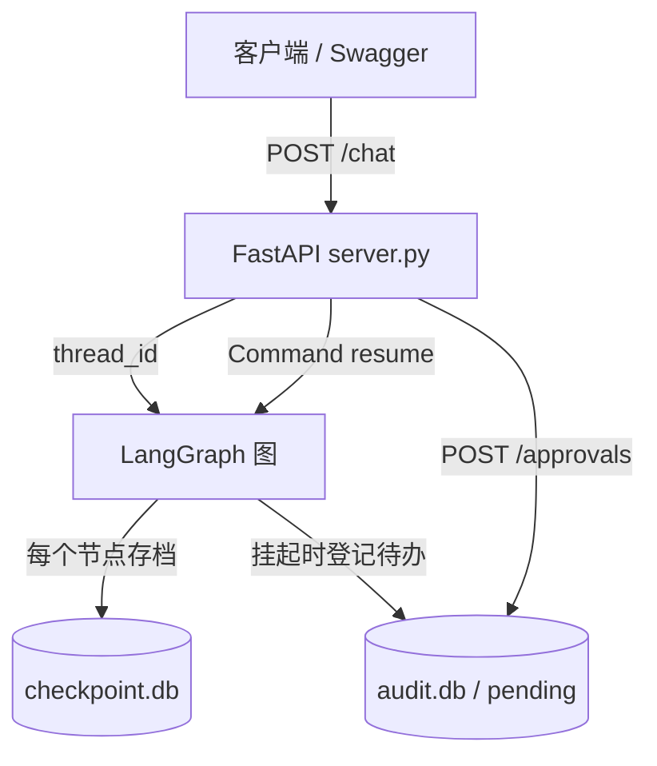

# 云栖商城 · 智能客服 Agent（Human-in-the-Loop）

> 一个能自己判意图、自己查订单、遇到退款/改地址这类高危操作会 **主动停下来等人点头** 的客服 Agent。
> 从零手写，核心是 LangGraph 的 `interrupt` + `checkpoint`，外面套一层 FastAPI 服务。

**关键词**：Python · LangGraph · Human-in-the-Loop · FastAPI · SQLite · Function Calling · DeepSeek

---

## 核心特性

| 特性 | 具体表现 |
|---|---|
| 意图三分类分流 | 每轮先用一次结构化输出把用户的话判成 `chat` / `query` / `high_risk`，再决定走哪条路 |
| 工具调用 | 订单查询 / 物流追踪 / 库存查询三个工具；调用者身份用 `InjectedState` 后端注入，模型伪造不了 |
| **高危操作必须人工审批** | 退款、改地址不会自动执行。图在 `approval_gate` 节点冻结，等人批准才动数据 |
| **未经审批的执行率 = 0%** | 所有副作用都在 `interrupt()` 之后；写操作不在模型手里，在代码手里 |
| 持久化记忆 | 每个节点的状态都落 SQLite，进程重启后会话和待办都还在 |
| 审计留痕 | 谁批的、何时批的、执行结果是什么，独立成表，可事后追责 |
| HTTP 服务化 | 5 个接口 + FastAPI 自动生成的 Swagger 文档页，前端可直接对接 |

---

## 效果预览

### case 1 · 普通咨询 → 直接回复

```bash
POST /chat
{"message": "你好，请问发货要几天？", "thread_id": "demo-1"}
```

```json
{"thread_id": "demo-1", "status": "done", "intent": "chat",
 "reply": "一般 48 小时内发货……", "ticket": null}
```

### case 2 · 查订单 → 走工具分支

```bash
POST /chat
{"message": "帮我查下 A1001 到哪了", "thread_id": "demo-2", "user_id": "u-1001"}
```

走向：`triage` 判 `query` → `query` 节点调 `track_logistics` → 返回真实物流节点。

### case 3 · 高危退款 → 挂起等审批（核心）

```bash
POST /chat
{"message": "订单 A1001 我要退款，退 299 元", "thread_id": "demo-3", "user_id": "u-1001"}
```

```json
{
  "thread_id": "demo-3",
  "status": "pending_approval",
  "reply": "这个操作需要人工审核后才能执行，我已经把申请提交上去了。",
  "intent": "high_risk",
  "ticket": {
    "ticket_id": "tk-6db56c",
    "action": "refund_order",
    "order_id": "A1001",
    "amount": 299.0,
    "summary": "订单 A1001 (硅胶烤垫 x2) 申请退款 ￥299.0"
  }
}
```

**注意：此时钱一分没动。** 审批人操作：

```bash
POST /approvals/tk-6db56c
{"status": "approved", "operator": "staff-01", "note": ""}
```

```json
{"ticket_id": "tk-6db56c", "thread_id": "demo-3", "status": "approved",
 "reply": "已为订单 A1001 退款 ￥299.0，预计 1-3 个工作日到账。"}
```

数据在这一刻才改，审计表同时补上执行结果。

### case 4 · 挂起中继续发消息 → 被接口拦下

```bash
POST /chat        # 同一个 thread_id，且上一单还没批
{"message": "算了不要退了", "thread_id": "demo-3"}
```

→ **HTTP 409**：

```json
{"detail": {"code": "thread_suspended",
            "message": "这个会话还挂着一张没批的审批单，先把审批做完再继续聊。",
            "ticket_id": "tk-6db56c"}}
```

**这条拦截是关键**：不拦的话，LangGraph 会把新消息当成新一轮、从 START 重跑整张图，那张审批单会**静默消失** —— 不报错、审计也不留痕。


---

## 架构

### 1. Agent 内部：一张有向图



### 2. 服务层：HTTP 怎么接上有状态的图



---

## 设计要点：4 个「为什么」

### 1. 为什么安全分流不能交给模型？

`route_intent` 是**纯 Python 函数**，不调 LLM：

```python
def route_intent(state) -> str:
    intent = state.get("intent", "chat")
    if intent == "high_risk":
        return "escalate"
    if intent == "query":
        return "query"
    return "chat"
```

模型只负责「理解用户说了什么」（它擅长），**分流和写操作全部由代码决定**（它不擅长、也不该碰）。
让模型自己决定「这笔退款要不要执行」= 把刹车交给油门。

### 2. 为什么 `approval_gate` 必须是一个独立节点？

因为 LangGraph 的 `interrupt()` **恢复时会把整个节点从头重跑一遍**。实测的节点执行序列：

```
['triage', 'approval_gate', 'approval_gate']
```

上游不重跑，但它自己跑两次。所以规矩是：**任何副作用都不能写在 `interrupt()` 之前。**

- `prepare_action` 只写 `state["pending_action"]`（一张提案），**绝不改业务数据**；
- 真执行放在 `execute_action`，它在 `interrupt()` 之后；
- `register_pending` 必须写在 `interrupt()` 之前（要抢在冻结前登记待办），所以它必须**幂等**：`ticket_id` 做主键 + `INSERT OR IGNORE`。

### 3. 为什么要在接口层拦「挂起中发新消息」？

实测过一个静默事故：挂起状态下传普通输入进去，LangGraph **不报错、不抛异常**，而是从 START 重跑整张图，那张审批单凭空消失（`next` 从 `('approval_gate',)` 变成 `()`、`__interrupt__` 字段消失）。

服务化之后这个问题会被放大（前端可能重复提交），所以在接口层第一件事就是查挂起状态：

```python
stuck = _pending_of(thread_id)
if stuck:
    raise HTTPException(status_code=409, detail={"code": "thread_suspended", ...})
```

### 4. 为什么审批接口要三道关卡？

因为前端的按钮会被重复点。三道关卡，一道都不能少：

| 关卡 | 检查什么 | 不通过 | 不拦的后果 |
|---|---|---|---|
| ① | `pending` 表里有没有这张单 | 404 `ticket_not_found` | 重复执行 → 退两次款 |
| ② | 这个会话现在还挂不挂着 | 409 `no_pending` | `Command(resume)` **不报错**，从 START 重跑整图 |
| ③ | 挂着的那张单是不是这张 | 409 `ticket_mismatch` | 张冠李戴，批 A 单执行 B 单 |

关② 最容易漏：**无挂起点时 `Command(resume=...)` 不会报错**，它会丢掉 resume 值然后重跑整张图（只有不传 checkpointer 时才报 `RuntimeError`）。

---

## 快速开始

### 1. 克隆 + 装依赖

```bash
git clone https://github.com/yangjian1205/proj2-support-agent.git
cd proj2-support-agent
python -m venv venv
venv/Scripts/activate                       # Windows；macOS/Linux 用 source venv/bin/activate
pip install -r requirements.txt -i https://pypi.tuna.tsinghua.edu.cn/simple
```

### 2. 配置密钥

新建 `.env`（**已在 .gitignore 里，不会被提交**）：

```
DEEPSEEK_API_KEY=sk-你的key
DEEPSEEK_BASE_URL=https://api.deepseek.com
DEEPSEEK_MODEL=deepseek-chat
```

### 3. 起服务

```bash
uvicorn server:app --reload --port 8000
```

### 4. 打开接口文档

浏览器访问 `http://127.0.0.1:8000/docs` —— FastAPI 自动生成的 Swagger 页，**不用写前端就能把所有接口点着测一遍**。建议第一件事先看 `GET /health`，返回 `{"ok": true, "graph_ready": true}` 说明图已经建好了。

### 5. 也可以走命令行入口

```bash
python main.py
```

命令行版把审批单打印到终端，用 `y/n` 确认。**两个入口读写同一个 `checkpoint.db` / `audit.db`** —— 命令行发起的审批，HTTP 接口也能批掉。

---

## API

| 方法 | 路径 | 说明 | 成功 | 失败 |
|---|---|---|---|---|
| GET | `/health` | 服务与图是否就绪 | 200 | — |
| POST | `/chat` | 发消息；高危时返回审批单 | 200 | 409 会话挂起中 / 422 参数非法 |
| POST | `/approvals/{ticket_id}` | 提交审批决定 | 200 | 404 无此单 / 409 未挂起或单号不符 / 422 status 非法 |
| GET | `/approvals` | 待办 + 历史一次拉全 | 200 | — |
| GET | `/sessions/{thread_id}` | 调试：看会话挂没挂、聊了几轮 | 200 | — |

**POST /chat 请求 / 响应**

```json
// 请求
{"message": "订单 A1001 我要退款", "thread_id": "demo-3", "user_id": "u-1001"}

// 响应 A：普通咨询
{"thread_id": "demo-3", "status": "done", "reply": "...", "intent": "chat", "ticket": null}

// 响应 B：高危，需审批
{"thread_id": "demo-3", "status": "pending_approval",
 "reply": "这个操作需要人工审核后才能执行，我已经把申请提交上去了。",
 "intent": "high_risk",
 "ticket": {"ticket_id": "tk-6db56c", "summary": "订单 A1001 (硅胶烤垫 x2) 申请退款 ￥299.0", "amount": 299.0}}
```

> ⚠️ `user_id` 目前是请求参数，**是为了演示越权拦截才留的口子**。真实系统里必须从登录态 / token 里取，绝不能让前端传。

**POST /approvals/{ticket_id} 请求体**

```json
{"status": "approved", "operator": "staff-01", "note": ""}
```

`status` 只接受 `approved` / `rejected`（Pydantic `Literal` 校验，传别的在进函数前就 422 了）。

---

## 实测数据

测试环境：Windows 11 / Python 3.12.2 / 单进程 uvicorn / 模型 `deepseek-chat`。

| 验证项 | 怎么测的 | 结果 |
|---|---|---|
| 真并发 | 4 个会话同时打 `/chat`（`scripts/bench_concurrent.py`） | 单个 4.3–4.6s，**总耗时 4.6s** → 真并行（若排队则约 17s） |
| 恢复耗时 | 调 `/approvals` 批准 | **0.2s**（恢复流程一次 LLM 都没调，全是确定性代码） |
| 待办幂等 | 同一 ticket 被调 2 次（节点重跑） | `pending` 表**始终 1 行**，接口返 200 而非 500 |
| 审批防重 | 同一张单批两次 | 第二次 **404**，没有重复退款 |
| 跨进程接手 | 造挂起单 → 重启服务 → 查待办 | 待办**还在**，可直接批掉 |
| 参数校验 | 传空 message / 非法 status | **422**，且在进入函数之前就被拦下（零模型调用） |

**并发为什么是真并行**：同步路由（`def` 而不是 `async def`）会被 FastAPI 丢进线程池执行。本机对照实测：`def` + 3 并发总耗时 **1.01s**，`async def` 因阻塞事件循环变成 **3.01s**。所以结论是：**同步库（sqlite3 / OpenAI SDK）一律写 `def`，把并发交给线程池。**

---

## 目录结构

```
proj2-support-agent/
├── agent/
│   ├── graph.py      8 个节点 + 4 组条件边（图的核心）
│   ├── state.py      共享状态契约（TypedDict + add_messages 归约器）
│   ├── tools.py      3 个工具 + 假业务数据 + 越权校验
│   ├── llm.py        模型工厂（全项目唯一的 LLM 创建入口）
│   └── audit.py      审计表 + 待办表
├── scripts/
│   └── bench_concurrent.py    并发验证脚本（需额外 pip install requests）
├── main.py           命令行入口（终端里 y/n 审批）
├── server.py         HTTP 服务入口（5 个接口）
├── requirements.txt
└── .env              配置（不进 git）
```

---

## 技术栈

| 层 | 选型 | 为什么 |
|---|---|---|
| Agent 编排 | LangGraph 1.2.12 | 需要「可中断 + 可持久化」的图，普通链做不到 |
| 状态持久化 | langgraph-checkpoint-sqlite 3.1.1 | 单机零依赖，`SqliteSaver` 自带线程锁 |
| 模型接口 | langchain-openai 1.6.4 → DeepSeek | DeepSeek 提供 OpenAI 兼容接口，换模型只改 `base_url` |
| Web 框架 | FastAPI 0.141.1 + uvicorn 0.52.1 | Pydantic 自动校验 + 自动生成 Swagger 文档 |
| 存储 | SQLite（Python 内置） | 演示规模够用，零运维 |

---

## 已知限制与后续计划

**当前定位是「单机演示规模」，不是生产系统。** 下面这些是**有意识的取舍**，不是没做完：

| 限制 | 现状 | 要上生产怎么改 |
|---|---|---|
| 单进程 | `SqliteSaver` 的锁是**进程内**的，`--workers 2` 下同一 thread 并发写会互相覆盖 | 换 `PostgresSaver`，审计表同迁 Postgres |
| SQLite 并发 | 单文件锁，写多时容易排队 | 同上 |
| 业务数据是假的 | `agent/tools.py` 里硬编码 3 个订单 | 换成真实订单 / 物流服务 API |
| 没有鉴权 | `user_id` 由请求传入（演示越权用） | 从 JWT / 登录态取 |
| 无观测 | 只有审计表 + 终端日志 | 接 LangSmith 或 OpenTelemetry |
| 无限流 | 没做压测，不报 QPS | 加限流 / 队列削峰 |

**下一步计划**：把知识库问答能力挂成第 4 个工具 —— 客服就能回答「你们的退换货政策是什么」这类制度问题，而不是只处理订单。

---

## 踩坑记录

都是实测撞出来的，不是从文档抄的。

**1. `with closing(conn)` 不会 commit。**
`closing()` 只负责 `close()`，跟 sqlite 事务无关。写库函数必须 `closing` + 手动 `c.commit()` 两件事都做。漏了的后果是：不报错、接口返 200，但**换一个连接查是 0 行** —— 静默丢数据。验证方法：写完立刻**另开一个连接**查。

**2. `.gitignore` 的行内注释会让整行规则失效。**
写成 `*.db  # 注释`，整行会被当成一个模式，匹配不到任何文件 → 数据库（含全部对话历史）直接进 git。**注释必须单独占一行**，用 `git check-ignore -v <file>` 验证（有输出才算被忽略）。

**3. `with_structured_output` 默认走 `json_schema`，DeepSeek 会返回 400。**
必须显式指定 `method="function_calling"`。

**4. `recursion_limit` 默认 10007。**
假模型死循环时跑了 137 秒才抛错。图执行时显式写 `"recursion_limit": 12` 当保险丝。

---

## License

学习项目，代码可自由参考。


